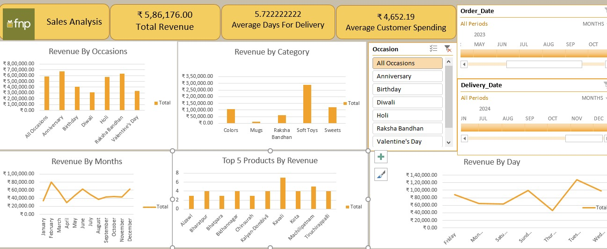

# FNP-Ferns-and-Petals-Sales-Analysis-Dashboard
This project presents an interactive Excel dashboard built from Ferns and Petals (FNP) sales data. FNP is a leading Indian gifting platform offering delivery for occasions like Diwali, Valentine’s Day, Raksha Bandhan, Anniversaries, and more. The dashboard aims to uncover patterns in customer behavior, sales performance And much more.

